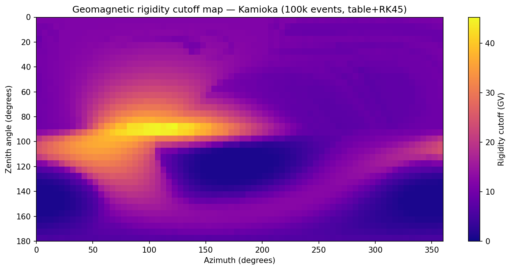

# Geomagnetic Cutoff Rigidities

The `GMRC` class computes geomagnetic rigidity cutoffs — the minimum
rigidity a cosmic ray must have to reach Earth from a given direction at a
given location.

Cutoffs are determined via Monte Carlo: random (zenith, azimuth) directions
are sampled, and for each direction the code scans rigidities from low to
high until the trajectory escapes Earth's field.

## Two evaluation modes

### `evaluate()` — Python-orchestrated

Supports all field types (`"igrf"`, `"dipole"`, `"table"`). Uses
`ProcessPoolExecutor` for `igrf`/`dipole` and `ThreadPoolExecutor` for
`table` (GIL released in C++).

```python
from gtracr.geomagnetic_cutoffs import GMRC

gmrc = GMRC(location="Kamioka", iter_num=10000, bfield_type="igrf",
            solver="rk4", n_workers=8)
gmrc.evaluate(dt=1e-5, max_time=1.)
```

### `evaluate_batch()` — C++ batch mode (fastest)

The entire MC loop — RNG, coordinate transforms, rigidity scanning, and
threading — runs in a single C++ call via `BatchGMRC`. Requires
`bfield_type="table"`. Achieves ~35k trajectories/second with `solver="rk45"`.

```python
gmrc = GMRC(location="Kamioka", iter_num=10000,
            bfield_type="table", solver="rk45")
gmrc.evaluate_batch(dt=1e-5, max_time=1., base_seed=42)
```

Pass `base_seed` for reproducible results. If omitted, a random seed is
chosen at runtime.

**Safety limit**: the C++ loop retries failed directions up to
`30 × iter_num` total attempts. If this limit is reached before
`iter_num` successful samples are collected, a `UserWarning` is raised and
`bin_results()` / `interpolate_results()` will have sparser coverage.

## Getting results

### `bin_results()` (recommended)

Bins MC samples into a regular (azimuth, zenith) grid. Fast and appropriate
for large sample counts.

```python
az_centres, zen_centres, cutoff_grid = gmrc.bin_results(
    nbins_azimuth=72, nbins_zenith=36
)
# cutoff_grid shape: (36, 72), NaN where no samples fell
```

### `interpolate_results()` (legacy)

Scattered interpolation via `scipy.interpolate.griddata`.

```python
az_grid, zen_grid, cutoff_grid = gmrc.interpolate_results()
```

## Parameters

### `GMRC` constructor

| Parameter | Default | Description |
|-----------|---------|-------------|
| `location` | `"Kamioka"` | Predefined detector location. |
| `iter_num` | `10000` | Number of MC samples. |
| `bfield_type` | `"igrf"` | Field model: `"igrf"`, `"dipole"`, or `"table"`. |
| `particle_type` | `"p+"` | Particle label. |
| `date` | today | IGRF date (`"yyyy-mm-dd"`). |
| `min_rigidity` | `5.` | Lower bound of rigidity scan (GV). |
| `max_rigidity` | `55.` | Upper bound of rigidity scan (GV). |
| `delta_rigidity` | `1.` | Rigidity step size (GV). |
| `n_workers` | physical CPUs | Number of parallel workers. |
| `solver` | `"rk4"` | Integrator: `"rk4"`, `"boris"`, or `"rk45"`. |
| `atol` | `1e-3` | Absolute tolerance (RK45). |
| `rtol` | `1e-6` | Relative tolerance (RK45). |

### `evaluate_batch()` parameters

| Parameter | Default | Description |
|-----------|---------|-------------|
| `dt` | `1e-5` | Time step in seconds. |
| `max_time` | `1.` | Maximum integration time per trajectory (seconds). |
| `base_seed` | `None` | Integer RNG seed for reproducibility. Random if `None`. |

## Solver recommendation

For GMRC evaluation, **`solver="rk45"`** with **`bfield_type="table"`** is
the fastest combination. The adaptive stepper takes ~100x fewer steps than
fixed-step RK4 for allowed trajectories, and the tabulated field eliminates
spherical harmonic computation.

## Complete example

```python
import numpy as np
import matplotlib.pyplot as plt
from gtracr.geomagnetic_cutoffs import GMRC

# 100k-sample batch evaluation at Kamioka
gmrc = GMRC(
    location="Kamioka",
    iter_num=100000,
    bfield_type="table",
    solver="rk45",
    min_rigidity=1.,
    max_rigidity=55.,
    delta_rigidity=0.5,
)
gmrc.evaluate_batch(dt=1e-5, max_time=1.)

# Bin into a 72×36 azimuth/zenith grid
az, zen, cutoffs = gmrc.bin_results(nbins_azimuth=72, nbins_zenith=36)
print(f"Grid shape: {cutoffs.shape}")
print(f"Mean cutoff: {np.nanmean(cutoffs):.1f} GV")

# Plot
fig, ax = plt.subplots(figsize=(10, 5))
im = ax.pcolormesh(az, zen, cutoffs, cmap="plasma", shading="auto", vmin=0)
fig.colorbar(im, ax=ax, label="Rigidity cutoff (GV)")
ax.set_xlabel("Azimuth (degrees)")
ax.set_ylabel("Zenith angle (degrees)")
ax.set_title("Geomagnetic rigidity cutoff map — Kamioka")
ax.invert_yaxis()
fig.tight_layout()
fig.savefig("gmrc_kamioka.png", dpi=150)
```


